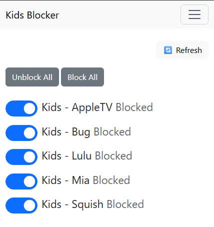

# UDM Firewall Toggler

## Overview

The UDM Firewall Toggler is a web application designed to manage and toggle firewall rules on a Ubiquiti Dream Machine (UDM). It requires local login credentials and direct access to the UDM. For security and accessibility, it is intended to be deployed behind an Nginx reverse proxy, allowing it to be safely exposed to the internet.

Specifically, I use it to block my kids access to the internet by blocking their devices. I create a homescreen bookmark on my wife's phone and she can block/unblock with the push of a button.



## Prerequisites

- Python 3.x
- Pipenv
- Docker
- Docker Compose

## Base Instructions

- Get your python environment setup
- `cp .env-example .env` and update it accordingly
  - Note: This will also get picked up by `docker-compose.yml`
- `pip intall -U pipenv`
- `pipenv sync`
- `pipenv shell`

## Dev/Test Instructions
- `pipenv shell`
- `./manage.py runserver 0.0.0.0:8000`

## Docker Deployment Instructions
- `docker compose up -d --build`

## Setup

1. **Clone the repository**:
    ```bash
    git clone <repository-url>
    cd <repository-folder>
    ```

2. **Install dependencies**:
    ```bash
    pipenv install --dev
    ```

3. **Activate the virtual environment**:
    ```bash
    pipenv shell
    ```

4. **Run migrations**:
    ```bash
    python manage.py migrate
    ```

5. **Run the development server**:
    ```bash
    python manage.py runserver
    ```

## Deployment

1. **Build and deploy with Docker Compose**:
    ```bash
    docker compose up -d --build
    ```

2. The application will be available at `http://localhost:8000` (or the configured port).

## Environment Variables

Ensure the following environment variables are set in a `.env` file:
- See [`.env-example`](.env-example)

## License

This project is licensed under the MIT License. See the `LICENSE` file for details.

## Contributing

Contributions are welcome! Please submit a pull request or open an issue for any changes or suggestions.